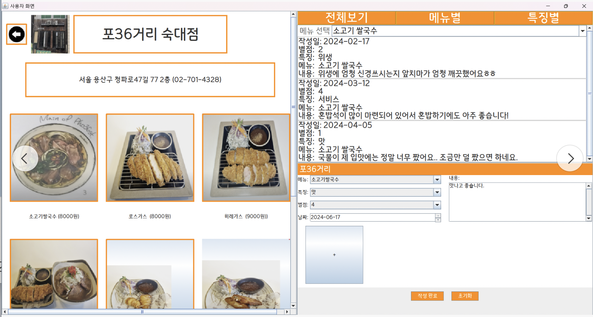
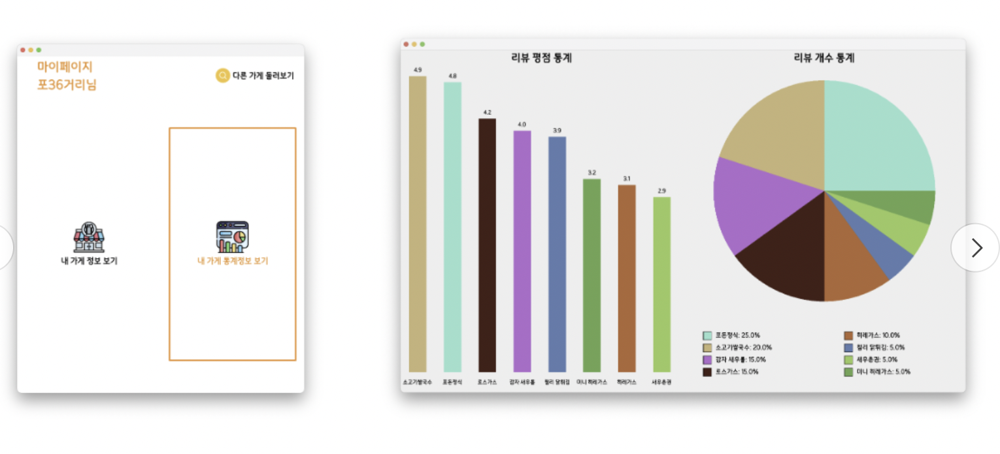

# 🍽️ 송직한리뷰 - 숙명여대 주변 맛집 리뷰 웹사이트

**송직한리뷰**는 숙명여자대학교 주변의 맛집 정보를 제공하고, 사용자 리뷰를 통해 신뢰할 수 있는 식당 정보를 공유하는 웹 애플리케이션입니다. Java를 기반으로 개발되었으며, 객체지향 프로그래밍(OOP) 원칙을 적용하여 설계되었습니다.

---

## 📌 주요 기능

- 📍 숙명여대 주변 맛집 목록 제공
- ⭐ 사용자 리뷰 및 평점 등록 기능
- 🔍 평점 기반 맛집 정렬 및 검색 기능
- 🖼️ 맛집 이미지 및 상세 정보 제공
- 👤 사용자 및 관리자용 데이터 관리 기능

---

## 🛠 기술 스택

- **언어**: Java
- **프레임워크**: Java Swing (GUI)
- **데이터 저장**: CSV 파일 기반
- **IDE**: IntelliJ IDEA

---

## 📁 프로젝트 구조

```
SM-OOP-project/
├── src/                       # Java 소스 코드
├── store_img/                 # 맛집 이미지 파일
├── store_img2/                # 추가 이미지 파일
├── 을의커피/                   # '을의커피' 관련 이미지
├── 포36거리/                   # '포36거리' 관련 이미지
├── DataSortedByRating.txt     # 평점 기준 정렬된 데이터
├── reviews.csv                # 사용자 리뷰 데이터
├── reviewsall.csv             # 전체 리뷰 데이터
├── store_data.csv             # 맛집 기본 정보
├── store_info.csv             # 맛집 상세 정보
├── store_scroll 2.csv         # 스크롤용 데이터
├── user_data.csv              # 사용자 정보
├── 관리자용정보등록.csv         # 관리자용 정보 등록 데이터
├── 리뷰평점.csv                # 리뷰 평점 데이터
├── back.jpg                   # 배경 이미지
├── 샐러드.jpg                  # 샐러드 이미지
├── 소고기 쌀국수.jpeg           # 소고기 쌀국수 이미지
├── 에스프레소.jpeg             # 에스프레소 이미지
├── 치즈돈가스.jpg               # 치즈돈가스 이미지
└── README.md                  # 프로젝트 소개 파일
```

---

## ▶️ 실행 방법

1. Java Development Kit (JDK) 설치
2. 프로젝트 클론:

   ```bash
   git clone https://github.com/wis-hyun/SM-OOP-project.git
   ```

3. IntelliJ IDEA에서 프로젝트 열기
4. `src` 디렉토리 내의 메인 클래스를 실행하여 애플리케이션 시작

---

## 🖼️ 화면 예시

> 애플리케이션 실행 화면 예시입니다:

  



---

## 🙋‍♀️ 개발자

- 김성현 (SungHyun Kim)  
- 숙명여자대학교 AI인공지능공학부
- 담당 : 관리자화면 구현 

---

## 📄 라이선스

이 프로젝트는 비상업적 학습 목적의 오픈소스입니다.  
자유롭게 참고 및 수정이 가능하며, 출처를 남겨주시면 감사하겠습니다.
